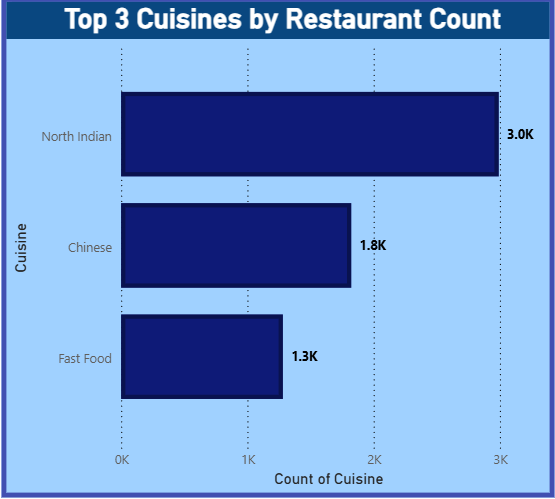
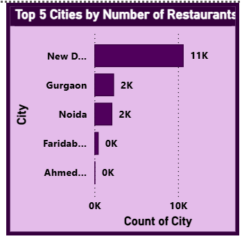
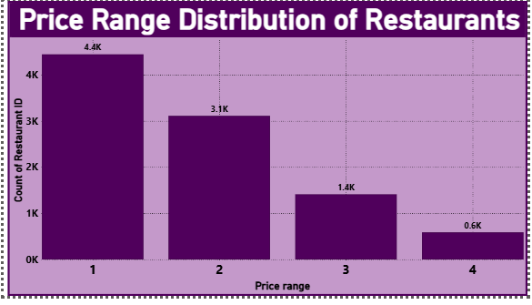
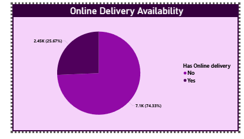

# 📊 Level 1 - Restaurant Data Analysis

---

## 🔹 Task 1: Top Cuisines
Analyzed most popular cuisines using Power BI.

---

## 🔹 Task 2: City Analysis
Identified cities with highest number of restaurants.

---

## 🔹 Task 3: Price Range Distribution
Analyzed restaurant distribution based on pricing.

---

## 🔹 Task 4: Online Delivery Analysis
Studied availability of online delivery services.

---

## 🛠 Tools Used
- Power BI
- Excel / CSV
- Data Cleaning (Power Query)

---

## 📁 Project Structure
Each task contains:
- Dashboard (.pbix)
- Screenshots
- Insights

---
## 👨‍💻 Author
Appu
